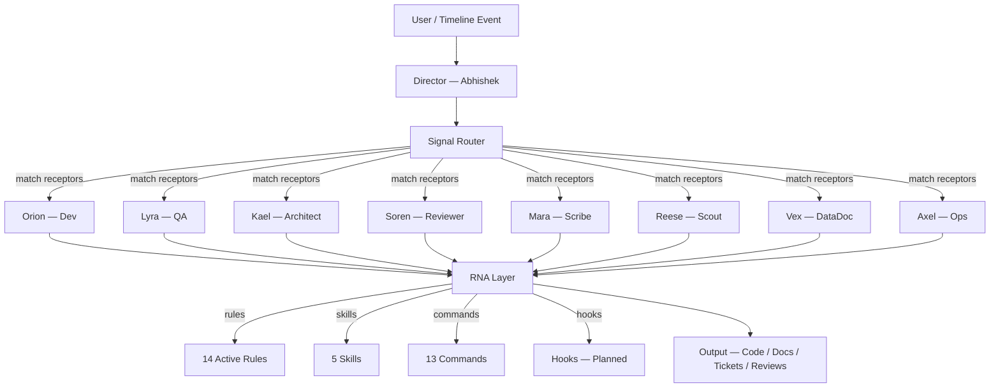
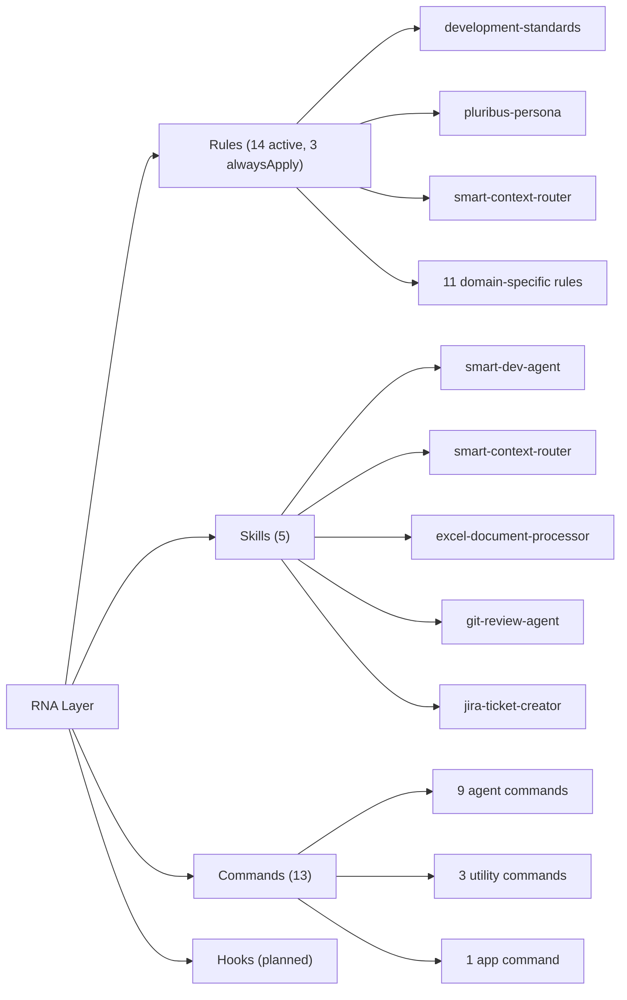
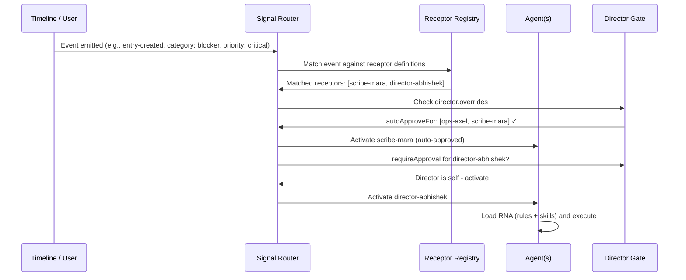
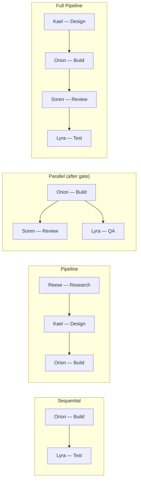

**Authors:** Abhishek Mittal
**Date:** March 2026
**Status:** POC Complete — Pattern Documented
**POC Platform:** Cursor IDE

---

## Abstract

Large-language-model-powered coding assistants have matured rapidly, yet they continue to suffer from three structural deficits: **no persistent memory** across sessions, **no role specialization** within a single workspace, and **no event-driven coordination** between concurrent agents. This paper introduces two complementary patterns that address all three gaps:

1. **Reusable Neural Activators (RNA)** — modular, declarative capability units (rules, skills, commands, hooks) that activate when signals match agent receptors, giving AI assistants persistent behavioral standards and reusable multi-step workflows.
2. **The Pluribus Agent Collective** — an orchestration layer of nine named specialist agents coordinated by a director through a signal network, enabling task routing, parallel joins, and model-cost optimization.

A proof-of-concept (POC) was built and battle-tested on the Cursor IDE over a four-week production sprint. The paper presents the architecture in platform-neutral terms, documents every implementation step, evaluates strengths and limitations, and provides a cross-platform implementation guide with exact file formats for Claude Code, GitHub Copilot, OpenAI Codex, VS Code, and Kimi Code.

**Key insight:** The value lies in the *architecture* — signal -> receptor -> agent -> RNA — not in any single tool. Teams can replicate the pattern on any AI-assisted IDE with agent and rule primitives.

---

## 1. Introduction

### 1.1 The Problem

Modern AI coding assistants (Cursor, Copilot, Claude Code, Codex) share a common architecture: a single conversational agent with access to tools and a codebase. This model breaks down as team and project complexity grow:

- **No persistent memory.** Each session starts from zero. Decisions, priorities, and team context are lost between conversations.
- **No role specialization.** A single agent is expected to architect, implement, test, review, document, and manage Jira tickets — all with the same persona and the same model.
- **No coordinated workflows.** There is no mechanism for one agent to hand off work to another, run tasks in parallel, or route events to the right specialist.
- **No signal-driven activation.** Agents respond only to direct prompts. There is no event bus where a timeline mutation (e.g., "blocker created") can automatically trigger the right agent with the right context.

### 1.2 Our Approach

We propose a two-layer solution:

| Layer | Pattern | Purpose |
|-------|---------|---------|
| **Capability Layer** | Reusable Neural Activators (RNA) | Modular, declarative units that encode behavioral constraints (rules), multi-step workflows (skills), fast-invoke shortcuts (commands), and lifecycle triggers (hooks) |
| **Orchestration Layer** | Pluribus Agent Collective | Named specialist agents with distinct personas, model assignments, and receptor definitions, coordinated by a director through a signal network |

The RNA layer gives each agent *"what to do"*. The Pluribus layer decides *"who does it"* and *"when"*.

### 1.3 Scope

The POC was implemented on Cursor IDE within a Node.js/React enterprise application (SCPT Costing — an apparel supply-chain costing platform). The paper treats Cursor as one implementation environment and provides portable equivalents for five other platforms.

---

## 2. System Architecture

### 2.1 High-Level Overview



### 2.2 The Agent Collective

Nine specialist agents plus one director form the Pluribus Collective. Each agent has a persona file, a model assignment, a command shortcut, and a receptor definition.

| # | Agent | Role | Command | Model | Signal Triggers |
|---|-------|------|---------|-------|-----------------|
| 1 | **Abhishek** | Director / Orchestrator | `/director-abhishek` | Opus / o3 | All signals |
| 2 | **Orion** | Full-Stack Developer | `/dev` | Sonnet / GPT-4o | sprint, delegation |
| 3 | **Lyra** | QA / Test Engineer | `/qa` | Sonnet | dod, premortem |
| 4 | **Vex** | Data / Document Processor | `/datadoc` | GPT-4o | Manual only |
| 5 | **Kael** | System Architect | `/architect` | Opus / o3 | sprint (critical/high) |
| 6 | **Soren** | Code Reviewer / Security | `/review` | Sonnet | dod |
| 7 | **Mara** | Scribe / Documentation | `/scribe` | Sonnet / GPT-4o | blocker, delegation, weekly |
| 8 | **Reese** | Explorer / Researcher | `/scout` | Fast / Default | Manual only |
| 9 | **Axel** | Operator / Automation | `/daily-ops` | Fast / Default | weekly, async |

**Model-cost optimization:** High-reasoning models (Opus, o3) are reserved for the Director and Architect — agents that make design decisions. Balanced models (Sonnet, GPT-4o) handle implementation and review. Fast models handle search and ops, minimizing cost for high-frequency, low-complexity tasks.

### 2.3 The RNA Layer

RNA units are organized into four categories:



#### 2.3.1 Rules (Behavioral Constraints)

Rules are declarative `.mdc` files with YAML frontmatter that constrain agent behavior. Three rules have `alwaysApply: true`, meaning they load into every conversation automatically:

| Rule | Purpose |
|------|---------|
| `development-standards` | Core coding guidelines: simplicity, readability, minimal changes, anti-patterns |
| `pluribus-persona` | Context-adaptive tone (Abhi/bro/Sir/Boss), suggest-first behavior, conflict resolution |
| `smart-context-router` | Always-on intent router that matches prompts to rules/skills/agents |

The remaining 11 domain-specific rules cover testing, Jira, PRs, QA docs, daily callouts, lambda migration, optimization, Playwright E2E, field validation, ECHO features, and cursor configuration. An archive of 19 superseded rules is maintained for reference.

#### 2.3.2 Skills (Multi-Step Capabilities)

Skills are structured `SKILL.md` files with sub-documents (checklists, templates, registries). Each skill defines a complete workflow:

| Skill | Owner Agent | Capability |
|-------|-------------|------------|
| `smart-dev-agent` | Orion | 10-phase development workflow with memory, ticket tracking, model selection |
| `smart-context-router` | Director | Intent scanning, receptor matching, rule/skill suggestion with user approval |
| `excel-document-processor` | Vex | File detection, formula extraction, cross-referencing, shared formula registry |
| `git-review-agent` | Soren | 6-category code review (security, logic, breaking changes, quality, performance, tests) |
| `jira-ticket-creator` | Mara | Business-first tickets, comments, sprint planning, story-point estimation, dependency mapping |

#### 2.3.3 Commands (Fast Invocation)

Commands are short markdown files that activate an agent with a single slash: `/dev`, `/qa`, `/architect`, `/review`, `/scribe`, `/scout`, `/datadoc`, `/daily-ops`, `/join`, `/signals`, `/team`, `/update-timeline`, `/echo-update-app`. They serve as the user-facing API to the collective.

#### 2.3.4 Hooks

Hooks provide automated lifecycle triggers — e.g., auto-run QA after implementation, auto-generate PR description after commit. They are defined in `receptors.json` and activated by git hooks or file watchers that emit signals to the signal server.

### 2.4 Recommended Folder Structure

The RNA method requires a persistent memory directory outside the IDE-specific config folder. The recommended convention is `_memory/rna-method/` at the project root:

```text
<project-root>/
  .cursor/             # (or .github/, CLAUDE.md, AGENTS.md -- platform-specific)
    agents/            # Agent definition files
    rules/             # Behavioral constraint files
    skills/            # Multi-step capability files
    commands/          # Fast-invoke shortcut files
  _memory/             # Persistent memory root (gitignored, local-only)
    rna-method/
      receptors.json   # Receptor registry, routes, hooks, director overrides
      timeline.json    # Intelligence hub: timeline entries + signal queue
      agent-context.json # Shared context for multi-agent joins (created per session)
      validate-registry.js # Registry health checker and sync auditor
      server.js        # Signal server with REST API (optional)
```

**Design principles:**
- `_memory/` is the root for all persistent AI state. It should be gitignored — it contains local context, not committed code.
- `_memory/rna-method/` holds the signal network infrastructure: receptor definitions, the intelligence hub, and tooling.
- The `receptors.json` file is the central registry — it defines all receptors (agents, rules, skills), signal routes, lifecycle hooks, and director overrides.
- `timeline.json` is the intelligence hub — it stores timeline entries, team profiles, and the signal queue. Its structure adapts to the project's needs.
- `agent-context.json` is ephemeral — created when a multi-agent join starts, deleted when the join completes.

| File | Purpose |
|------|---------|
| `receptors.json` | Central registry of all receptor definitions, predefined routes, lifecycle hooks, and director approval gates |
| `timeline.json` | Persistent team intelligence: profiles, prioritized entries, and the signal queue |
| `agent-context.json` | Ephemeral shared state for multi-agent joins — created by the Director at join start, read/written by participating agents |
| `validate-registry.js` | Scans all RNA artifacts, validates receptor paths, detects duplicates, flags stale references |
| `server.js` | Optional Express server exposing REST endpoints for signals, context, and registry health |

> **POC note:** The proof-of-concept used `work/_team-nav/` as the memory directory and named the receptor registry `pluribus.json` after the agent collective. The generic convention above is recommended for new adoptions.

### 2.5 The Signal Network

The signal network connects timeline events to agent receptors.



**Receptor Registry** (`receptors.json`): Each receptor defines `triggerEvents`, `matchCategories`, `matchPriorities`, and `capabilities`. The registry contains 23 receptors — 9 agents, 10 rules, 4 skills.

> **POC note:** The POC file was named `pluribus.json` after the agent collective. The recommended generic name is `receptors.json`.

**Routes** (6 predefined): Declarative rules that map event+category+priority combinations to agent activation sets. Examples:
- Critical blocker -> Mara (Jira ticket) + Director (investigation), no approval needed
- Sprint task (critical/high) -> Orion (build), director approval required
- DoD completion -> Soren (review) + Lyra (QA), director approval required

**Director Overrides**: The Director controls the approval gate:
- `alwaysNotify`: blocker, critical — Director is always informed
- `autoApproveFor`: Axel, Mara — low-risk agents proceed without approval
- `requireApproval`: Orion, Kael, Soren — high-impact agents need Director confirmation

### 2.6 The Intelligence Hub

The intelligence hub (`_memory/rna-method/timeline.json`) stores:
- **Team profiles** with roles, skills, sprint assignments, capacity, allocated hours, availability status, and current tickets
- **Timeline entries** with timestamps, type, content, status, priority, source, linked Jira tickets, MoSCoW classification, RICE scores, and SWOT quadrants
- **Signal queue** for pending signals awaiting receptor matching

This hub provides persistent memory across sessions — any agent can read the timeline to understand current priorities, team capacity, and historical decisions.

---

## 3. Implementation Steps (Chronological)

> **Convention note:** The POC used `work/_team-nav/` as the memory directory and `pluribus.json` as the receptor registry filename. The recommended generic convention is `_memory/rna-method/` with `receptors.json`. Steps below reflect the original POC paths.

The POC was built incrementally over a four-week production sprint. Each step built on the previous:

1. **Timeline v2** — Extended the single-person timeline system into a multi-member team hub with `meta`, `team` (19 profiles), `entries`, and `signals` arrays.
2. **Signal emission** — Built a local Express server (`server.js`) with POST/PATCH endpoints that emit signals on timeline CRUD operations.
3. **Receptor registry** — Designed `pluribus.json` with category/priority/event matching and director approval gates.
4. **Agent definitions** — Created 9 agent definition files (`.cursor/agents/*.md`) with personas, model assignments, context loaders, and handoff protocols.
5. **RNA layer — Rules** — Consolidated 19 rules into 14 active rules with 3 `alwaysApply`. Archived superseded versions for reference.
6. **RNA layer — Skills** — Built 5 skills with sub-documents: smart-dev-agent (10-phase workflow), smart-context-router (full registry), excel-document-processor (formula registry), git-review-agent (6-category review), jira-ticket-creator (5 workflows).
7. **RNA layer — Commands** — Created 13 command files for fast agent invocation (`/dev`, `/qa`, `/join`, `/signals`, etc.).
8. **Smart Context Router** — Built the always-on rule that matches user prompts against the full registry using keyword tables, then asks before applying.
9. **Per-agent model selection** — Assigned models by task complexity: Opus/o3 for Director/Architect, Sonnet/GPT-4o for Dev/QA/Reviewer/Scribe, Fast for Scout/Ops.
10. **Pluribus Dashboard** — Built HTML UIs (`timeline-panel.html`, `sprint-viewer.html`) for signal queue visualization, team roster, and receptor registry browsing.
11. **Document processor toolkit** — Created Python utilities (`extract_excel.py`, `extract_pdf.py`, `create_pptx.py`) using openpyxl, xlwings, PyMuPDF, and python-pptx.
12. **Rule consolidation and archiving** — Merged overlapping rules (e.g., `api-testing-standards` + `master-testing-rule` + `test-manager-rule` -> `testing-standards`), reducing maintenance surface from 19 to 14 active rules.
13. **Registry validation and sync audit** — Built `validate-registry.js` that scans all RNA artifacts, validates receptor paths, detects duplicate triggers, flags stale references, and reports unregistered/orphaned files. Exposed as `npm run validate` and `GET /api/registry/health`.
14. **Shared agent context** — Implemented `agent-context.json` protocol with REST API (`/api/context` CRUD) for file-based shared state between agents during multi-agent joins. Updated Director joining protocol to create/read/write context sessions.
15. **Lifecycle hooks** — Added `hooks` array to `pluribus.json` with 3 hook definitions (post-commit, pre-push, rna-updated). Created Husky git hooks that emit signals via `POST /api/signals`. Server matches incoming signals against hook definitions.
16. **Platform-neutral RNA schema** — Defined `rna-schema.json` as the canonical format encoding all agents, rules, skills, commands, hooks, routes, and joining patterns. Built 4 adapter scripts (Cursor, Claude Code, Copilot, Codex) that generate native files from the schema.

---

## 4. Joining Patterns

The Director orchestrates multi-agent workflows through five joining patterns:



| Pattern | Agents | Flow |
|---------|--------|------|
| Build + Test | Orion -> Lyra | Sequential |
| Design + Build | Kael -> Orion | Sequential |
| Build + Review + Test | Orion -> (Soren \|\| Lyra) | Sequential then parallel |
| Research + Design + Build | Reese -> Kael -> Orion | Pipeline |
| Full Pipeline | Kael -> Orion -> Soren -> Lyra | Design -> Build -> Review -> Test |

---

## 5. Evaluation

### 5.1 Strengths

| Strength | Evidence |
|----------|----------|
| **Consistent agent behavior** | `alwaysApply` rules enforce coding standards, persona tone, and routing logic across every conversation |
| **Specialist routing reduces context pollution** | A Jira task goes to Mara (scribe), not the developer agent — each agent loads only relevant RNA |
| **Model-cost optimization** | Fast models for Scout/Ops (~$0.001/call) vs Opus for Director/Architect (~$0.05/call); estimated 60-70% cost reduction vs all-Opus |
| **Portability** | RNA modules are file-based — copy `.cursor/` to another project and the entire system transfers |
| **Signal-driven activation** | Timeline mutations auto-trigger relevant agents; no manual "who should handle this?" decisions |
| **Team intelligence** | Team hub with capacity tracking, sprint awareness, and historical decision context |
| **Maintainability** | Rule consolidation (19 -> 14) with archived versions keeps the system clean while preserving history |

### 5.2 Limitations (Original) and Resolutions

| Limitation | Impact | Resolution |
|------------|--------|------------|
| **Poll-based signal processing** | Signals are checked on demand, not pushed in real-time | **Deferred.** WebSocket push planned; current REST polling is functional. |
| **Isolated agent context** | Sub-agents cannot share memory within a single orchestration | **Resolved.** `_memory/rna-method/agent-context.json` shared context protocol with REST API (`/api/context`). Director creates a join session; each agent reads/writes shared state via file. |
| **Silent rule conflicts** | Overlapping rules can stall or confuse agents | **Resolved.** `validate-registry.js` scans all RNA artifacts, detects duplicate triggers, flags stale references to archived rules, and validates receptor paths. Available via `npm run validate` and `GET /api/registry/health`. |
| **Maintenance overhead** | 9 agents + 14 rules + 5 skills + 13 commands = 41 artifacts to sync | **Resolved.** Sync audit mode in `validate-registry.js` detects unregistered files, orphaned receptors, and stale references. `--fix` flag auto-cleans `receptors.json`. |
| **No hooks yet** | Lifecycle automation (auto-QA after build, auto-PR after commit) requires manual invocation | **Resolved.** `hooks` array in `receptors.json` defines lifecycle triggers. Git hooks (`.husky/post-commit`, `.husky/pre-push`) emit signals via `POST /api/signals`. Server matches signals against hook definitions. |
| **Platform coupling** | `.mdc` format and Cursor's Task tool are platform-specific | **Resolved.** `rna-schema.json` defines a platform-neutral canonical format. Four adapter scripts generate native files for Cursor, Claude Code, GitHub Copilot, and OpenAI Codex. |

---

## 6. Cross-Platform Portability

The RNA + Pluribus pattern is not Cursor-specific. The table below summarizes migration paths; the companion document `cross-platform-implementation-guide.md` provides exact file paths, formats, and code samples.

| Concept | Cursor (POC) | Claude Code | GitHub Copilot | OpenAI Codex | VS Code | Kimi Code |
|---------|--------------|-------------|----------------|--------------|---------|-----------|
| **Agent definitions** | `.cursor/agents/*.md` | `CLAUDE.md` + orchestrator | `.github/agents/*.agent.md` | `AGENTS.md` roles | `.agent.md` files | YAML agent files |
| **Rules** | `.cursor/rules/*.mdc` | `CLAUDE.md` sections | `.github/copilot-instructions.md` | `AGENTS.md` + overrides | `AGENTS.md` + `.instructions.md` | System prompt files |
| **Skills** | `.cursor/skills/*SKILL.md` | MCP tools | MCP extensions | Codex Skills | MCP tools | `subagents` YAML |
| **Commands** | `.cursor/commands/*.md` | CLI `--agents` | Handoff protocol (→ §8) | N/A (prompt-based) | Agent handoffs (→ §8) | `--agent-file` |
| **Signal network** | `receptors.json` + Express | Orchestrator agent | GitHub Actions webhooks | Native multi-agent | N/A | N/A |
| **alwaysApply rules** | YAML `alwaysApply: true` | Root `CLAUDE.md` | Repo-wide instructions | Root `AGENTS.md` | Root `AGENTS.md` | System prompt args |
| **Migration difficulty** | - | **Medium** | **Medium-Hard** | **Medium** | **Medium** | **Hard** |

---

## 7. Conclusion & Future Work

### 7.1 Key Takeaway

RNA + Pluribus is a **portable architectural pattern**, not a product feature. The value is in the four-layer flow:

`Signal -> Receptor Matching -> Agent Activation -> RNA Execution -> Output`

Any AI-assisted development environment with agent primitives and file-based configuration can implement this pattern. The POC demonstrates that even a single developer can operate a nine-agent collective effectively, with the Director agent serving as the coordination layer.

### 7.2 Future Work

| Initiative | Description | Priority |
|------------|-------------|----------|
| **Push-based signals** | WebSocket-based real-time signal routing to replace polling | High |
| **Cross-project RNA sharing** | npm/pip package of RNA modules for team-wide reuse | Medium |
| **Velocity benchmarking** | A/B measurement of development velocity with and without the RNA method | High |
| **Agent learning** | Feedback loops where agent performance data refines receptor weights | Medium |
| **Hook marketplace** | Community-contributed hooks for common workflows | Low |
| **_memory/ standardization** | Formal spec for the `_memory/` directory across projects and teams | Low |
| **Programmatic handoff SDK** | Invoke agent handoff steps via VS Code Copilot programmatic API, removing the current manual copy-paste step | Medium |

### 7.3 Getting Started

Teams can adopt the pattern incrementally:

1. **Create the memory directory** — Set up `_memory/rna-method/` in your project root (add `_memory/` to `.gitignore` — it is local-only persistent state)
2. **Start small** — 3 agents (Director, Developer, Reviewer) + 5 rules (coding standards, persona, testing, PR, context router)
3. **Add signal routing** — Create `receptors.json` and define receptors for your most common workflow triggers
4. **Grow incrementally** — Add specialists (QA, Scribe, Scout) as team needs emerge
5. **Consolidate regularly** — Archive superseded rules; maintain a single registry as source of truth

---

## 8. Handoff Protocol & Join Pipelines (GitHub Copilot)

### 8.1 Handoffs vs Signal-Driven Joins

Cursor's Pluribus layer uses a signal-driven join mechanism: the Director agent monitors `receptors.json`, detects a matching signal, and orchestrates multi-agent pipelines programmatically. GitHub Copilot does not (yet) expose a programmatic invocation API — there is no equivalent of a running Express signal server.

To achieve equivalent multi-agent coordination in Copilot, the RNA-Pluribus implementation for Shuhari introduces the **Handoff Protocol**: a structured, human-relayed coordination mechanism that preserves full join semantics without requiring a signal server.

| Dimension | Cursor Signal Joins | Copilot Handoff Protocol |
|---|---|---|
| Trigger | Automatic (file event, git hook, schedule) | Manual (user copies handoff block) |
| Context passing | `receptors.json` + in-memory state | `agent-context.json` (shared file) + handoff block |
| Agent invocation | Orchestrator calls agents directly | User opens fresh thread, pastes invocation line |
| Join state | In-memory during session | Persisted in `agent-context.json` across sessions |
| Terminal condition | Director detects completion | Terminal agent closes join, clears state |
| IDE dependency | Cursor-specific | IDE-agnostic (any tool reading `.github/`) |

### 8.2 The Handoff Protocol Design

Each handoff is a formatted block output by the sending agent at the end of its step:

```
━━━ HANDOFF ━━━━━━━━━━━━━━━━━━━━━━━━━━━━━━━━━━━━━━━━━━━━━━━━━
From:     @<current-agent>
To:       @<next-agent>
Join ID:  <taskId from agent-context.json>
Step:     <N> of <total>
Context:  <1–3 sentences: what was done, key decisions>
Artifacts: <bullet list of file paths written>
Your task: <exactly what the next agent should do>
━━━━━━━━━━━━━━━━━━━━━━━━━━━━━━━━━━━━━━━━━━━━━━━━━━━━━━━━━━━━━
@<next-agent> [HANDOFF from @<current-agent>] <Your task line>
```

The user copies only the last line and opens a fresh thread. This is the **sole manual step** in the protocol.

**Shared state** is maintained in `_memory/rna-method/agent-context.json`. Each agent reads this file on receiving a handoff to reconstruct full join context — the conversation history is never relied upon:

```json
{
  "activeJoins": [{
    "joinId": "<slug>",
    "pattern": "<pipeline-name>",
    "currentStep": 2,
    "completedSteps": ["riko-orient"],
    "artifacts": ["_memory/agents/riko/2026-03-01_task_brief.md"],
    "participatingAgents": ["riko", "shino", "samba", "twilight"],
    "startedAt": "<ISO 8601>"
  }],
  "checkpoints": []
}
```

### 8.3 Three Shuhari Join Pipelines

Three canonical join patterns are defined in `.github/agents/joins/`:

| Pattern | Agents | Steps | File |
|---|---|---|---|
| `research-to-content` | @shino → @shuhari-research-curator | 2 | `.github/agents/joins/research-to-content.md` |
| `design-to-build` | @twilight → @samba → @twilight | 3 | `.github/agents/joins/design-to-build.md` |
| `full-feature` | @riko → @shino → @samba → @twilight | 4 | `.github/agents/joins/full-feature.md` |

Each pipeline file specifies: step-by-step agent behavior, exact handoff block format, `agent-context.json` example at each stage, and terminal agent join-close procedure.

### 8.4 GitHub Actions as the Signal Bridge

The current handoff protocol is **Level 1 (manual)**. Two upgrade levels bridge toward full signal-driven joins:

```
Level 1 — Manual Handoff (current)
  User copies handoff block → pastes into fresh thread
  Suitable for: small teams, exploratory workflows

Level 2 — GitHub Actions Bridge
  A workflow monitors agent-context.json pushes
  When currentStep advances, Actions posts a comment on the PR / dispatches an event
  Suitable for: CI-integrated workflows, async team coordination

Level 3 — Programmatic SDK
  VS Code Copilot exposes a programmatic invocation API
  Director agent calls @next-agent directly without user relay
  Suitable for: full autonomous pipelines (future capability)
```

For Level 2, the bridge is a GitHub Actions workflow that watches for changes to `_memory/rna-method/agent-context.json` on push:

```yaml
on:
  push:
    paths: ['_memory/rna-method/agent-context.json']
jobs:
  relay-handoff:
    runs-on: ubuntu-latest
    steps:
      - uses: actions/checkout@v4
      - name: Post handoff notification
        run: node .github/scripts/relay-handoff.js
```

### 8.5 Cross-Platform Context Continuity

The 3-tier context model ensures no session state is lost across agent invocations or thread resets:

| Tier | Storage | Scope | Lifecycle |
|---|---|---|---|
| **Long-term** | `_memory/agents/<slug>/` session logs + `timeline.json` | Permanent project memory | Never deleted; updated after every session |
| **Active join** | `agent-context.json` `activeJoins[]` entry | Duration of a multi-agent join | Cleared by terminal agent on join completion |
| **Ephemeral checkpoint** | `_memory/rna-method/checkpoints/<date>_<task>.json` | Single agent's mid-session state | Deleted on task completion; pointer in `checkpoints[]` |

Checkpoints are task-indexed (not agent-indexed), making them IDE-agnostic — any agent in any tool can load a checkpoint written by a different agent or even a different IDE, as long as it has access to the workspace root.

`validate-registry.js` enforces hygiene: it flags checkpoint pointers in `agent-context.json` that point to missing files (orphaned) or entries older than 7 days (stale).

---

## Appendix A: Artifact Inventory

### Recommended (Generic) Locations

| Category | Count | Location |
|----------|-------|----------|
| **Agent definitions** | 9 + 1 registry | `.cursor/agents/` (or platform equivalent) |
| **Active rules** | 14 (3 alwaysApply) | `.cursor/rules/` (or platform equivalent) |
| **Archived rules** | 19 | `.cursor/rules/_archive/` |
| **Skills** | 5 (15 files total) | `.cursor/skills/` (or platform equivalent) |
| **Commands** | 13 | `.cursor/commands/` (or platform equivalent) |
| **Receptor registry** | 23 receptors, 6 routes, 4 hooks | `_memory/rna-method/receptors.json` |
| **Intelligence hub** | Team profiles, entries, signal queue | `_memory/rna-method/timeline.json` |
| **Shared context** | On-demand join state | `_memory/rna-method/agent-context.json` |
| **Registry validator** | 1 script (6 checks) | `_memory/rna-method/validate-registry.js` |
| **Signal server** | REST API for signals/context | `_memory/rna-method/server.js` |
| **Git hooks** | 2 (post-commit, pre-push) | `.husky/` |
| **RNA schema** | 1 canonical JSON | Repo root or docs folder |
| **Platform adapters** | 4 (Cursor, Claude, Copilot, Codex) | Repo root or docs folder |

### POC-Specific Locations (Historical Reference)

| Category | POC Location |
|----------|--------------|
| **Receptor registry** | `work/_team-nav/pluribus.json` |
| **Intelligence hub** | `work/_team-nav/timeline.json` |
| **Dashboard UIs** | `work/_team-nav/*.html` |
| **Python utilities** | `work/utilities/doc-processor/` |
| **Registry validator** | `work/_team-nav/validate-registry.js` |
| **Signal server** | `work/_team-nav/server.js` |
| **RNA schema** | `work/rna-pluribus-research/rna-schema.json` |
| **Platform adapters** | `work/rna-pluribus-research/adapters/` |

## Appendix B: Glossary

| Term | Definition |
|------|------------|
| **RNA** | Reusable Neural Activator — a modular capability unit (rule, skill, command, or hook) |
| **Receptor** | A JSON object defining when an agent or RNA should activate, based on event type, category, and priority |
| **Signal** | An event emitted by a timeline mutation or user action that is matched against receptors |
| **Route** | A predefined mapping from signal conditions to agent activation sets |
| **Join** | A multi-agent workflow pattern: sequential, parallel, or pipeline |
| **Director** | The orchestrating agent that approves activations, manages joins, and resolves conflicts |
| **alwaysApply** | A rule flag that ensures the rule loads into every conversation automatically |
| **Receptor Registry** | The central JSON file (`receptors.json`) containing all receptor definitions and routes |
| **Intelligence Hub** | The timeline JSON file (`_memory/rna-method/timeline.json`) storing team profiles, entries, and the signal queue |

---

*Paper version: 1.1 — March 2026*

*Changelog: v1.1 — Added §8 (Handoff Protocol & Join Pipelines), updated §6 Commands column, added §7.2 Programmatic Handoff SDK row. Reflects Shuhari Hub implementation.*
*Companion: [Cross-Platform Implementation Guide](/guides/cross-platform)*
